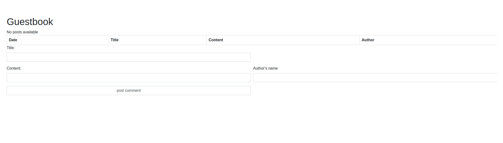
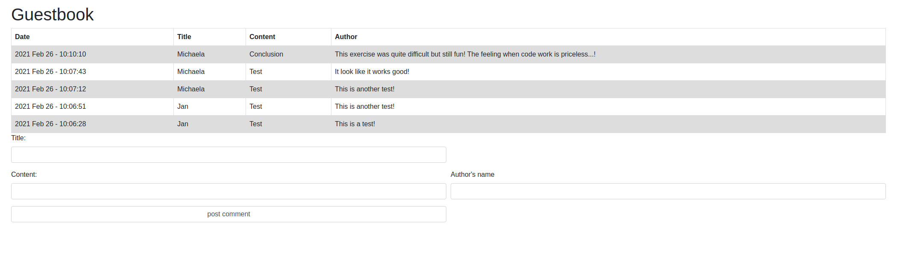

# PHP Guestbook

### A project created by me - a student of BeCode during our PHP language training.

>[Michaela Harinova](https://github.com/mharin)

#### This project is our first consolidation challenge type when we are working with OOP (object oriented programming) in PHP.
#### We need to learn and improve basic understanding of OOP plus storing and converting of data files.

## Used technologies:
- PHP (OOP)
- CSS
- HTML

## Learning objectives
> - Storing data in files
> - Converting complex constructs (array/objects) to string representation.
> - Deliver a project under a strict deadline 

## The Mission
> Let's remember the internet of the 1990, and create a classic widget that every site in that decade had: a guestbook. 
> 
> Any visitor on the page can leave a message/post there.   
> 
> Posts are then saved and showed for everybody who visits the page.

### Creation is based on "must have" features such as:
> - Title
> - Date
> - Content
> - Author's name

> - Use min 2 classes (OOP)
> - Sort the messages from new (top) to old (bottom)
> - The script can handle site defacement attacks
> - Only show the latest 20 posts
> 

## Interface of Guestbook
>#### Starting screen
>

>#### When posted messages
>

